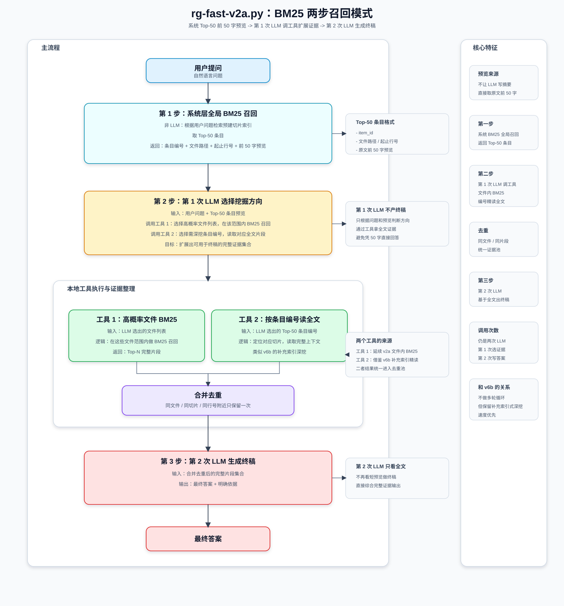
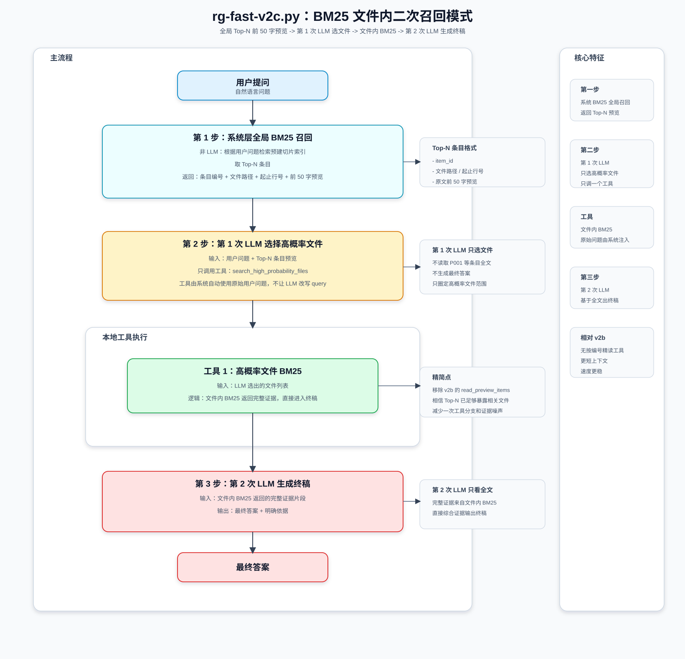

# rg_search_v6b.py Agent 运行逻辑

本文档记录 `rg_search_v6b.py` 当前版本的完整运行逻辑：从启动、索引加载、模型调用、工具循环、补充扫描，到最终答案和回答依据抽取。

## 1. 总体定位

`rg_search_v6b.py` 是一个面向本地规范资料库的检索问答 Agent。它使用 OpenAI-compatible Chat Completions 接口驱动大模型，让模型在多轮对话中自主调用本地工具：

- `get_document_toc`：读取指定文档的详细目录。
- `execute_grep`：调用 `rg` 搜索关键词，并返回命中行上下文。
- `fetch_supplemental`：按补充扫描索引编号读取原文上下文。
- `read_file_range`：读取指定文件的指定行范围。

当前默认资料库是 `specs/`，默认索引目录是 `specs/.index/`。Agent 会先把资料库全局目录放进 system prompt，再让模型根据问题逐轮选择检索工具。工具返回原文证据后，模型继续判断是否还要换关键词、查目录、读上下文或读取补充索引；直到它不再请求工具，程序再生成最终答案，并额外调用一次模型抽取回答依据。

## 2. 运行流程图

<p align="center">
  
</p>

流程图源文件：[`v6b_flow.svg`](v6b_flow.svg)

## 3. 启动与初始化

程序启动时会完成这些工作：

1. 导入标准库、`OpenAI`、`dotenv` 和 `extract_toc.scanner.scan_folder`。
2. 调用 `load_dotenv()` 读取 `.env`。
3. 将脚本目录加入 `sys.path`，保证本地模块可导入。
4. 通过 `num = 1` 从 `MODEL_DICT` 中选择模型，当前默认是 `kimi-k2.5`。
5. 设置 `TARGET`、`INDEX_DIR`、`MAIN_INDEX` 和 `RG_EXE`。
6. 扫描 `TARGET` 下的 `.txt` 和 `.md` 文件，生成 `FILE_MAP`。
7. 初始化缓存：`DETAIL_TOC_CACHE`、`SEARCH_RESULT_CACHE`、`SUPPLEMENT_CACHE`、`SUPPLEMENT_KEY_MAP`、`CLIENT`。

`MODEL_DICT` 中每个模型配置通常包含 `base_url`、`.env` 中的 `api_key` 环境变量名、`model_name`，以及可选的 `thinking` 类型。`get_client()` 会懒加载 OpenAI 客户端，并复用全局 `CLIENT`。

## 4. 模型调用封装

`build_chat_kwargs()` 负责组装 Chat Completions 请求参数，包括 `model`、`messages`、`temperature`、`stream`、`tools` 和 `tool_choice="auto"`。如果模型配置里声明了 `thinking` 类型，它还会适配不同厂商的思考模式参数：

| 类型 | 控制方式 |
|---|---|
| `kimi` | `extra_body={"thinking": {"type": "disabled"}}` |
| `qwen` | `extra_body={"enable_thinking": thinking_enabled}` |
| `deepseek` | `extra_body={"thinking": {"type": "enabled" / "disabled"}}` |

`_chat_stream()` 统一消费流式输出，聚合普通回答文本、reasoning 内容和工具调用。它还兼容部分模型最后一个 chunk 里 `choices=[]` 的情况，避免越界错误。

## 5. 索引与目录

`ensure_index_exists()` 检查 `specs/.index/index.json` 是否存在；如果不存在，就调用 `scan_folder(str(TARGET), recursive=True, output_dir=str(INDEX_DIR))` 重新生成索引。

`get_global_toc_summary()` 读取全局目录，并把 JSON 字符串注入 `run_agent()` 的 system prompt，让模型一开始就知道资料库结构。

`get_document_toc(filename)` 是暴露给模型的工具。它按文件名片段匹配 `FILE_MAP`，再读取 `specs/.index/{stem}.index.json`，用于查看某个文档的详细章节目录。

`get_chapter_context(filepath, line_num)` 根据文件和行号，从详细目录中推断命中行所在章节、小节，并生成类似 `[出自：第X章 -> 第Y节 | 本章小节: ...]` 的上下文。搜索结果和补充索引都会尽量注入这个章节信息。

## 6. run_agent 主循环

入口函数是：

```python
run_agent(user_question, show_reasoning=False, stream=False, extract_refs=True)
```

参数含义：

| 参数 | 默认值 | 作用 |
|---|---:|---|
| `user_question` | 必填 | 用户问题 |
| `show_reasoning` | `False` | 是否显示模型 reasoning 字段 |
| `stream` | `False` | 是否以 generator 方式返回运行过程 |
| `extract_refs` | `True` | 最终答案后是否抽取回答依据 |

每次运行先调用 `reset_search_cache()`，清空 `SEARCH_RESULT_CACHE`、`SUPPLEMENT_CACHE` 和 `SUPPLEMENT_KEY_MAP`。然后构造两条初始消息：system prompt 和用户问题。

system prompt 的关键纪律是：必须调用工具查阅资料；必须明确引用依据；信息不足时继续换关键词、查目录或读原文；必须全面收集相关规范，不能找到一处就停止；最终回答前最少进行一次批量精读补充索引内容。

主循环最多执行 15 轮。每轮先调用 `_chat_stream(messages, TOOLS_SCHEMA, ...)`，如果模型返回 `tool_calls`，程序就解析工具名和参数，调用本地函数，并把工具结果作为 `role="tool"` 的消息追加回 `messages`。如果模型没有返回工具调用，说明它准备回答，程序进入最终答案阶段。

如果 15 轮后仍未结束，程序会追加 `已达到最大搜索次数，请立即总结回答`，然后强制生成最终答案。

## 7. execute_grep 主搜索

入口函数：

```python
execute_grep(pattern, include_files=None, stream=False)
```

基础命令：

```bash
rg -n -i -H -C {CONTENT_LINES} -e {pattern} -m 50
```

| 参数 | 作用 |
|---|---|
| `-n` | 输出行号 |
| `-i` | 忽略大小写 |
| `-H` | 输出文件名 |
| `-C` | 返回命中行上下文 |
| `-e` | 指定搜索表达式 |
| `-m 50` | 每个文件最多 50 个匹配 |

当模型传入 `include_files` 时，代码会按文件名片段从 `FILE_MAP` 中挑选目标文件，只在这些文件中搜索。否则直接搜索整个 `TARGET` 目录。

主搜索会按 `(filepath, line_number)` 写入 `SEARCH_RESULT_CACHE` 去重，避免多轮搜索反复返回同一条命中。结果会经过 `annotate_grep_output()` 转换成更适合模型阅读的格式：

```text
[下面内容出自：文件名-->章节上下文]
行号123-->原文内容
  行号124-->上下文内容
--
```

主搜索可能命中很多条，但实际只把前 20 条新记录展开给模型，以控制 token。

## 8. 补充扫描机制

补充扫描是这个版本的重要增强点。它解决的问题是：模型有时会先限定一两本高概率规范搜索，如果这些文件已经命中，它可能过早停止，漏掉其他规范中的相关条文。

触发条件：`execute_grep()` 使用了 `include_files`，并且限定文件内有命中。

触发后，`_supplemental_grep_lines(pattern, excluded_names, limit=30, preview_chars=50)` 会排除主搜索已经限定的文件，只扫描剩余文件。它使用更轻量的命令：

```bash
rg -n -i -H -e {pattern} -m 12 {remaining_files}
```

补充扫描不带 `-C`，不返回大段上下文；每个剩余文件最多 12 条命中，全局最多返回 30 条短索引。每条补充命中会生成 `S001`、`S002` 这样的编号，并写入 `SUPPLEMENT_CACHE` 和 `SUPPLEMENT_KEY_MAP`。

返回给模型的补充索引类似：

```text
补充ID=S001 | 文件=xxx.txt | 原文行=2539 [出自：...]
索引预览-->...命中关键词周边内容...
```

如果模型判断某条补充索引可能相关，应该继续调用 `fetch_supplemental(ids="S001,S003")` 批量精读。

## 9. fetch_supplemental 批量精读

入口函数：

```python
fetch_supplemental(ids, context_lines=CONTENT_LINES, stream=False)
```

它根据补充编号读取原文上下文，并做几类保护：

- 标准化编号，例如 `S1` 转成 `S001`。


---

# rg-fast-v2b/v2c BM25 双轨检索对比

## 16. fast 系列的核心设计

`rg-fast-v2b.py` 和 `rg-fast-v2c.py` 代表了另一条技术路线：**BM25 预筛选 + 两次 LLM 调用**。

核心思路是在让 LLM 参与之前，先用 BM25 算法对全库进行快速召回，生成一个 Top-N 的短预览列表。然后通过两次 LLM 调用完成最终问答：
- **第 1 次 LLM**：基于预览选择证据挖掘方向，调用本地工具获取完整原文
- **第 2 次 LLM**：基于完整证据生成最终答案

这种设计的目标是**在保证召回质量的前提下，减少 LLM 的检索决策负担，提升响应速度**。

## 17. v2b：两步召回 + 两个工具

<p align="center">
  
</p>

流程图源文件：[`v2a_bm25_two_step_flow.svg`](v2a_bm25_two_step_flow.svg)

### 运行流程

1. **系统层全局 BM25 召回**
   - 将所有文档按 512 字切片，构建全局 BM25 索引
   - 根据用户问题召回 Top-50 切片
   - 返回每条切片的：编号（P001、P002...）、文件名、行号、**原文前 50 字预览**

2. **第 1 次 LLM 调用工具**
   - 输入：用户问题 + Top-50 短预览
   - 任务：判断哪些方向值得深挖，调用两个本地工具
   - 工具 1：`search_high_probability_files` - 选择高概率文件列表，在这些文件内做 BM25 召回完整片段
   - 工具 2：`read_preview_items` - 选择 Top-50 中值得深挖的条目编号（如 P001、P018），读取完整上下文

3. **合并去重**
   - 将两个工具返回的证据按 `(文件, 行号)` 去重
   - 保证不同来源的同一证据只保留一次

4. **第 2 次 LLM 生成终稿**
   - 输入：合并去重后的完整证据片段
   - 输出：最终答案 + 明确依据

### 设计特点

- **两个工具互补**：工具 1 延续文件内 BM25 思路，工具 2 借鉴 v6b 的补充索引精读机制
- **短预览 token 友好**：Top-50 只返回前 50 字，避免首轮 token 爆炸
- **第 1 次 LLM 不产终稿**：只负责选择挖掘方向，避免基于 50 字预览强行回答
- **两次调用固定流程**：不支持多轮迭代，速度优先

## 18. v2c：一步召回 + 单工具

<p align="center">
  
</p>

流程图源文件：[`v2c_bm25_file_only_flow.svg`](v2c_bm25_file_only_flow.svg)

### 运行流程

1. **系统层全局 BM25 召回**
   - 同 v2b，返回 Top-N 短预览

2. **第 1 次 LLM 只选文件**
   - 输入：用户问题 + Top-N 短预览
   - 任务：判断哪些文件最可能包含答案
   - 只调用一个工具：`search_high_probability_files`

3. **文件内 BM25 完整召回**
   - 在选中的文件范围内重新做 BM25 召回
   - 直接返回完整证据片段，不再需要二次精读

4. **第 2 次 LLM 生成终稿**
   - 输入：文件内 BM25 返回的完整证据
   - 输出：最终答案 + 明确依据

### 相对 v2b 的精简点

- **移除 `read_preview_items` 工具**：不再按编号精读 Top-N 条目
- **单一证据来源**：所有证据都来自文件内 BM25，无需合并去重
- **更短上下文**：第 1 次 LLM 只需判断文件，决策压力更小
- **速度更稳**：工具调用路径更短，流程更可控

## 19. v2b 与 v2c 效果接近的原因

实践表明，**v2b 的两个工具并没有带来显著的召回优势，v2c 的单工具流程在多数问题上表现接近**。

为什么会这样？

1. **Top-N 预览已经暴露了高概率文件**
   - BM25 全局召回的 Top-30 或 Top-50 条目中，相关文件通常会集中出现
   - LLM 从预览中就能准确判断文件范围，不需要工具 2 再去精读编号

2. **文件内二次 BM25 已经足够精确**
   - 在限定文件范围后，文件内 BM25 会重新排序，通常能召回关键证据
   - 工具 1 返回的证据质量已经满足终稿需求

3. **工具 2 的边际收益有限**
   - 按编号精读 Top-N 条目的逻辑是"怀疑预览不足"
   - 但实际上 Top-N 切片如果真的相关，文件内 BM25 也会再次命中
   - 工具 2 更多是保险机制，实际触发价值不高

4. **去重环节反而增加复杂度**
   - 两个工具返回的证据可能有重叠，需要额外去重
   - v2c 的单工具流程避免了这个问题

## 20. 双轨检索的局限性

尽管 v2b 和 v2c 在速度上有优势，但它们有一个共同的局限：**不能自主扩展检索范围**。

### 为什么双轨检索不一定是最优的？

1. **BM25 预筛选可能遗漏相关文档**
   - BM25 是统计算法，对同义词、概念转换理解能力弱
   - 建筑规范中常见"同一概念多种表述"（如"拦风绳"vs"缆风绳"）
   - 如果用户问题的术语和文档用词不匹配，BM25 可能漏召回

2. **预先限定范围限制了 LLM 的能力**
   - v2b/v2c 的第 1 次 LLM 只能在 Top-N 预览范围内选择
   - 如果 BM25 遗漏了关键文档，LLM 无法补救
   - LLM 不能像 v6b 那样根据全局目录动态调整检索策略

3. **两次调用流程不支持迭代推理**
   - 复杂问题可能需要多轮换词、跨文档推理
   - v2b/v2c 固定两次调用，无法支持"发现证据不足后换关键词"的场景

## 21. 三种信息提供方式对比

综合 v6b、v2b、v2c 的设计，可以总结出三种为 LLM 提供检索线索的方式：

### 方式 A：BM25 预览 + 两步召回（v2b）

- **思路**：系统先用 BM25 返回 Top-N 短预览，LLM 调用两个工具（文件内 BM25 + 按编号精读）扩展证据
- **优势**：速度快、两个工具互补、预览 token 友好
- **劣势**：不能自主扩展、两次调用无迭代、工具 2 边际收益低

### 方式 B：BM25 预览 + 一步召回（v2c）

- **思路**：系统先用 BM25 返回 Top-N 短预览，LLM 只选文件并调用文件内 BM25
- **优势**：速度最快、流程最短、token 消耗最少
- **劣势**：不能自主扩展、对 BM25 准确性依赖更高

### 方式 C：全局目录 + 多轮工具检索（v6b）

- **思路**：给 LLM 提供全局目录，让它自主选择工具（`execute_grep`、`fetch_supplemental`、`read_file_range` 等）
- **优势**：LLM 保持主动性、支持多轮迭代、补充扫描防遗漏、容错能力强
- **劣势**：需要更多轮 LLM 调用、总耗时可能更长

| 特性 | v2b | v2c | v6b |
|---|---|---|---|
| 初筛方式 | BM25 算法 | BM25 算法 | LLM 根据全局目录 |
| 初始信息 | Top-N 短预览 | Top-N 短预览 | 全局目录 |
| 第 1 次 LLM | 选文件 + 选编号 | 只选文件 | 调用检索工具 |
| 工具数量 | 2 个 | 1 个 | 4 个 |
| 检索范围 | 预先限定 | 预先限定 | 动态扩展 |
| 补充扫描 | 不支持 | 不支持 | 自动触发 |
| 迭代推理 | 不支持 | 不支持 | 支持多轮 |
| 速度 | 快 | 最快 | 中 |
| 遗漏风险 | 中高 | 高 | 低 |

## 22. 核心结论

实践表明：**对于 BM25 而言，让 LLM 知道"答案在哪些文件中"比直接给它搜索结果更重要**。

- **v2b 和 v2c 效果接近**：说明"按编号精读 Top-N 条目"的工具 2 价值有限，文件内 BM25 已经足够
- **v6b 容错能力更强**：全局目录 + 多轮工具检索的模式，在 BM25 可能失效的场景下仍能自主调整策略
- **速度与准确率的权衡**：v2c 速度最快但对 BM25 依赖高，v6b 更全面但需要更多轮次

### 未来优化方向

三种方式并不互斥，可以考虑混合设计：

1. **提供 BM25 建议而非限制**：在 v6b 的全局目录中标注 BM25 相关性分数，辅助 LLM 优先级判断，但不强制限定范围
2. **详细目录 vs 短预览**：目前的"提供目录"是一个**尚未实现的新思路**，可以探索给 LLM 提供 BM25 筛选文档的详细章节目录，而非短预览或原文切片
3. **动态工具选择**：让 LLM 根据问题复杂度自主决定是走"快速两次调用"还是"多轮深度检索"
